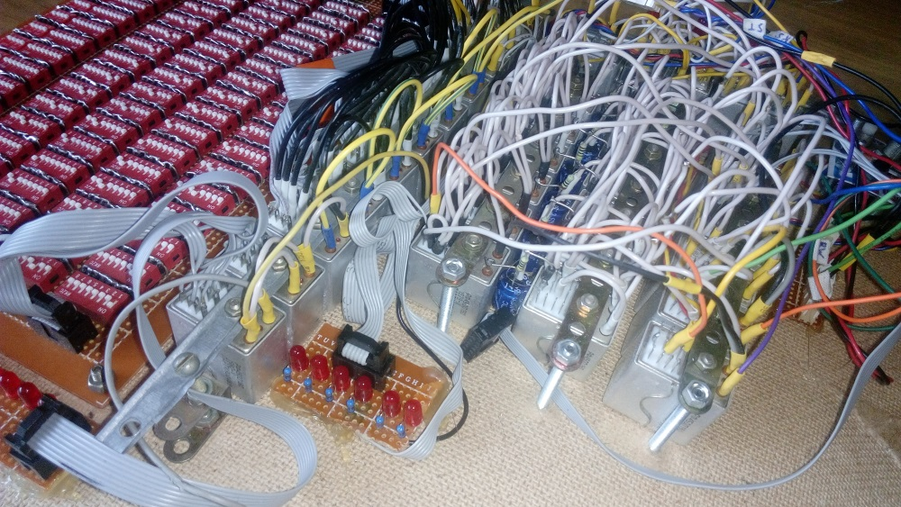

# R200 Relay Computer

*oh gods, here goes nothing…*

## About
R200 project is a personal project centered around creating general purpose relay computer. "200" in the name suggests that the machine will be constructed with use of about 200 electromagnetic relays.

## but WHY?!
I mean... You've probably come to the wrong place if that's the question that bothers you. (= Seriously, though, the purpose of the project is entirely recreational. i.e. DON'T FORGET YOU'RE HERE FOR FUN.

With that being said, let's get down to business.

## Ground rules
1.	The machine should be self-sufficient and independent of any external entities except for power supply and a human operator.
2.	No semiconductors allowed except diodes. (there’s gonna be TONS of diodes, though)

## Machine specs
The machine is based on the harvard architecture (separate program and data memory).
### Block diagram

### Specs
Bus
- 12-bit data bus
- 8-bit instructions
- 6-bit program address bus
- 4-bit RAM address bus
- 4-bit CONST MEMORY address bus

Memory
- ROM (Program memory): 64 x 8-bit instructions (implemented as array of 64 by 8 dip-switches)
- CONST MEMORY: 16 x 12-bit words (implemented as array of 16 by 12 dip-switches)
- RAM: 8 x 12-bit words (implemented as array of 8 by 12 electrolytic capacitors)
- Registers: 
  - 2x12-bit GPRs [RA and RB] (implemented as array of 2 by 12 relays)
  - 6-bit Program Counter [PC] (implemented as array of 6 relays)
  - 6-bit Leaf Register (implemented as array of 6 electrolytic capacitors)

ALU
- Some of 16 functions of ALU: add/sub, inc/dec, shift right/left, bit-wise not/and/or/xor
- ALU can only operates on GPRs [RA and RB]
- Carry Flag [CF]
- Zero Flag [ZF]

I/O
- Input: dip-switches of CONST MEMORY are designed to be used as user input
- Output: every bit of GPRs [RA and RB] has an LED. At the end of a program the result should be loaded in GPRs in order to be read by user

Clock
- Every instruction is executed in one machine cycle. All instructions are single-worded. One machine cycle consists of 2 clock pulses. One machine cycle approximately takes 0.45sec. of real time.

Hardware
- 200+ 48V 4PDT (4-pole double-throw) electromagnetic relays 
- 1000+ 1N4001 diodes
- 150+ 220uF electrolytic capacitors
- 40+ LEDs
- 704 individual switches
- 300+ resistors
- 3A power supply (temporary switched-mode type, so technically it breaks the second ground rule)

## Documentation
The only somewhat finished now piece of documentation is the instruction set.
- General instructions
- ALU instructions

## Important notes
Due to the physical implementation limitations, any RAM word and LEAF register can only be read ones. Once the RAM location or LEAF register has been read its state becomes undefined. That’s why if you want to preserve value in a RAM, you must write it back to the same location immediately every time it has been read. In the emulator RAM a word resets to 0 after it has been read.

## Emulation 
There’s simple command-line emulator available, made in C#. It accepts assembler file as an input, does simple preprocessing and executes the programm. No actual byte-code generation present.

Preprocessor functions: removes comments and empty lines, resolves names of constants, variables and labels.

